# db

A simple SQLite database in R for genomic prediction.

|**Build Status**|**License**|
|:--------------:|:---------:|
| <a href="https://github.com/jeffersonfparil/db/actions"></a> | [](https://www.gnu.org/licenses/gpl-3.0) |


## Installation

```R
devtools::install_github("jeffersonfparil/db")
```

## Quickstart

```R
set.seed(123)
list_fnames_tables  = db::fn_simulate_tables(
    n_entries=50,
    n_dates=3,
    n_sites=3,
    n_treatments=3,
    n_loci=10e3,
    save_data_tables=TRUE)$list_fnames_tables
fname_phenotypes_tsv = list_fnames_tables$fname_phenotypes
fname_environments_tsv = list_fnames_tables$fname_environments
db::fn_create_database_from_xlsx_or_tsv(fname_db="test.sqlite", fname_phenotypes_tsv=fname_phenotypes_tsv, fname_environments_tsv=fname_environments_tsv)

ok_2 = fn_update_database_from_xlsx_or_tsv(fname_db=fname_db, fname_xlsx=NULL, fname_phenotypes_tsv=fname_phenotypes_tsv, fname_environments_tsv=fname_environments_tsv, fname_genotypes_tsv=fname_genotypes_tsv)


```

## Schema

Each database will correspond to a single species with the schema below. **The 7 base tables are shown on top while the 3 data tables are at the bottom**. Base tables have fixed number of columns while the data tables have a dynamic number of tables where user can continually add more columns.

```mermaid
erDiagram
    %%%%%%%%%%%%%%%%%%%%%%%%%%%%%%%%%%%%%%%%%%%%%%%%%%%%%%%%%%%%%%%%%%%%%%%%%%%%%%%%%%%
    %%% Individuals, pools, or any level of single to multiple plant representation %%%
    %%%%%%%%%%%%%%%%%%%%%%%%%%%%%%%%%%%%%%%%%%%%%%%%%%%%%%%%%%%%%%%%%%%%%%%%%%%%%%%%%%%
    entries {
        TEXT ENTRY_HASH
        REAL ENTRY_UID
        TEXT ENTRY
        TEXT TYPE
        TEXT POPULATION
        TEXT CULTIVAR
    }
    %%%%%%%%%%%%%%%%%%%%%%%%%%%%%%%%%%%%%%%%%%%%%%%%%%%%%%%%%%%%%%%%%%%%%%%%%%%%%%%%%%%%%
    %%% Dates, times, and FVI seasons of measurements of traits and abiotic variables %%%
    %%%%%%%%%%%%%%%%%%%%%%%%%%%%%%%%%%%%%%%%%%%%%%%%%%%%%%%%%%%%%%%%%%%%%%%%%%%%%%%%%%%%%
    dates {
        TEXT DATE_HASH
        REAL DATE_UID
        REAL POSIX_DATE_TIME
        REAL YEAR
        REAL MONTH
        REAL DAY
        REAL HOUR
        TEXT FVI_YEAR_SEASON
    }
    %%%%%%%%%%%%%%%%%%%%%%%%%%%%%%%%%%%%%%%%%%%
    %%% Location of trials and measurements %%%
    %%%%%%%%%%%%%%%%%%%%%%%%%%%%%%%%%%%%%%%%%%%
    sites {
        TEXT SITE_HASH
        REAL SITE_UID
        TEXT SITE
        TEXT DESCRIPTION
    }
    %%%%%%%%%%%%%%%%%%%%%%%%%%%%%%
    %%% Treatment descriptions %%%
    %%%%%%%%%%%%%%%%%%%%%%%%%%%%%%
    treatments {
        TEXT TREATMENT_HASH
        REAL TREATMENT_UID
        TEXT TREATMENT
        TEXT DESCRIPTION
    }
    %%%%%%%%%%%%%%%%%%%%%%%%%%%
    %%% Traits descriptions %%%
    %%%%%%%%%%%%%%%%%%%%%%%%%%%
    traits {
        TEXT TRAIT_HASH
        REAL TRAIT_UID
        TEXT TRAIT
        TEXT DESCRIPTION
    }
    %%%%%%%%%%%%%%%%%%%%%%%%%%%%%%%%%%%%%%%%%%%%%%%%%%%
    %%% Climatic and edaphic variables descriptions %%%
    %%%%%%%%%%%%%%%%%%%%%%%%%%%%%%%%%%%%%%%%%%%%%%%%%%%
    abiotics {
        TEXT ABIOTIC_HASH
        REAL ABIOTIC_UID
        TEXT ABIOTIC
        TEXT DESCRIPTION
    }
    %%%%%%%%%%%%%%%%%%%%%%%%%%%%%%%%%%%%%%%%%%%%%%%%%%%%%%%%%
    %%% Loci coordinates and identities across the genome %%%
    %%%%%%%%%%%%%%%%%%%%%%%%%%%%%%%%%%%%%%%%%%%%%%%%%%%%%%%%%
    loci {
        TEXT LOCUS_HASH
        REAL LOCUS_UID
        TEXT CHROMOSOME
        REAL POSITION_PER_CHROMOSOME
        TEXT ALLELE
    }
    %%%%%%%%%%%%%%%%%%%%%%%%%%%%%%%%%%%%%%%%%%%%%%%%%%%%%%%%%%%%%%%%%%%%%%%%%%%%%
    %%% Phenotype data per entry, replication, treatment, site, and date-time %%%
    %%%%%%%%%%%%%%%%%%%%%%%%%%%%%%%%%%%%%%%%%%%%%%%%%%%%%%%%%%%%%%%%%%%%%%%%%%%%%
    phenotypes {
        TEXT PHENOTYPE_HASH
        REAL PHENOTYPE_UID
        TEXT ENTRY
        TEXT TREATMENT
        TEXT REPLICATION
        TEXT PLOT
        TEXT ROW_OR_BLOCK
        TEXT COLUMN
        TEXT SITE
        REAL POSIX_DATE_TIME
        REAL _NUMERIC_AND_BINARY_TRAITS_
        TEXT _CATEGORICAL_TRAITS_
    }
    %%%%%%%%%%%%%%%%%%%%%%%%%%%%%%%%%%%%%%%%%%%%%%%%%%%%%%%%%%%%%%%%%%%%%%%%%%%%%%%%%%%%%%
    %%% Environmental data, i.e. abiotic variables including climatic and edaphic data %%%
    %%%%%%%%%%%%%%%%%%%%%%%%%%%%%%%%%%%%%%%%%%%%%%%%%%%%%%%%%%%%%%%%%%%%%%%%%%%%%%%%%%%%%%
    environments {
        TEXT ENVIRONMENT_HASH
        REAL ENVIRONMENT_UID
        TEXT TREATMENT
        TEXT REPLICATION
        TEXT SENSOR
        TEXT SITE
        REAL POSIX_DATE_TIME
        REAL _NUMERIC_AND_BINARY_ABIOTICS_
        TEXT _CATEGORICAL_ABIOTICS_
    }
    %%%%%%%%%%%%%%%%%%%%%%%%%%%%%%%%%%%%%%%%%%%
    %%% Genotype data per entry across loci %%%
    %%%%%%%%%%%%%%%%%%%%%%%%%%%%%%%%%%%%%%%%%%%
    %%% Note that allele frequencies across loci are save as a blob per entry sorted in the same way as the base table loci
    genotypes {
        REAL ENTRY_UID
        BLOB _ALLELE_FREQUENCIES_ACROSS_ALL_LOCI_
    }
    %%%%%%%%%%%%%%%%%%%%%
    %%% Relationships %%%
    %%%%%%%%%%%%%%%%%%%%%
    entries ||--|| phenotypes : ""
    entries ||--|| genotypes : ""
    dates ||--|| phenotypes : ""
    dates ||--|| environments : ""
    traits ||--o{ phenotypes : "defines the trait fields"
    sites ||--|| phenotypes : ""
    sites ||--|| environments : ""
    treatments ||--|| phenotypes : ""
    treatments ||--|| environments : ""
    abiotics ||--o{ environments : "defines the abiotic variables"
    loci ||--o{ genotypes : "defines the loci"
```



### Base and data tables

| Base       | Data         |
| :--------- | :----------- |
| entries    | phenotypes   |
| dates      | environments |
| sites      | genotypes    |
| treatments | -            |
| traits     | -            |
| abiotics   | -            |
| loci       | -            |


### A brief apology for the schema

1. Genotypes refer to individuals, population, families or pools as long as they relate to a single line of allele frequencies or genotype values in some genotype matrix.
2. [POSIX time](https://en.wikipedia.org/wiki/Unix_time) is used to have a low memory-footprint date-time relator across tables with the dates table detailing the human-readable dates, times and FVI seasons.
3. Requirements for input data frames should allow the automatic updates of the base tables (i.e. entries, dates, traits, sites, treatments, abiotics, and/or loci) so that there is no need to manually upload theses information which should reduce error.
4. Duplicate entries should be avoided by table-specific UIDs (except in the genotype table which uses the entries: ENTRY_UID as well as the loci UID: LOCUS_UID for its rows and column names). These UIDs should relate to specific genotypes, dates, traits, sites, treatments, abiotic variables, loci, and the sensible combinations of them, e.g. genotype-date-site-treatment-replication combination in the phenotypes table should define a row-specific PHENOTYPE_UID.
5. There is one database for each species because rarely do we need to analyse multiple species at a single trial (maybe not in the future looking at mixed pastures). This limitation is caused by the simple encoding of the loci and genotypes table where each column in the former refers to a locus which should be present across all entries which may span hundreds of thousands to millions of loci.
6. There are 3 input or data tables which are imported into the database from which the base tables will be extracted from. The data tables are the:
    - phenotypes (contains the phenotype data for multiple traits including the dates, sites replications associated with the trials/measurements), 
    - environments (contains the climatic and edpahic measurements from the trial sites including the date, time and location of the measurements) and 
    - genotypes (contain the allele frequencies per entry across genome-wide loci) tables.
7. Hashing is used to determine initial uniqueness of each row of the data tables (i.e. phenotypes, and environments table, excluding the genotypes tables - the uniqueness of which will be based upon the required columns per table for hashing efficiency) upon importation into the database so that we can efficiently compare existing and incoming data after which we assign integer UIDs for more efficient queries.

